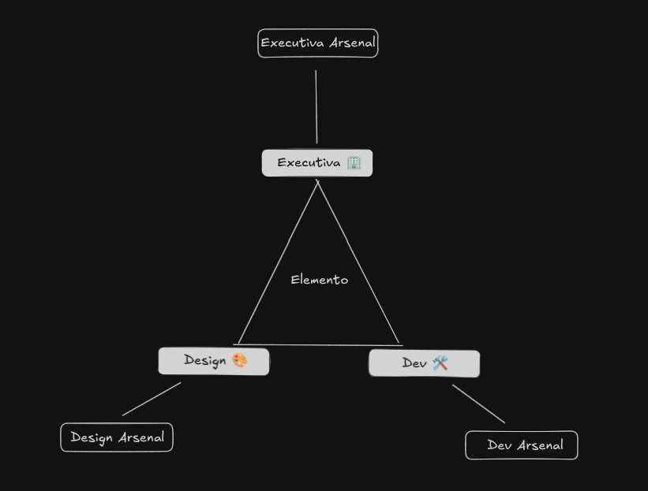

## What it is
A thinking, documentation, and decision-making protocol for projects involving strategy, user experience, and technology.

The 3 Bases Framework organizes any project under 3 complementary and independent perspectives — Executive, Design, and Dev — ensuring no decision is made in isolation.

## Visual representation

If you understand this image, you understand 50% of the framework.

> Humans seem to think naturally in threes, and the triangle is no coincidence: it is the most stable geometric shape: 3 bases, 3 perspectives, no hierarchy between them.

## How it started

Born from a concrete need: [@MatheusDAVeloso](https://github.com/MatheusDAVeloso), building a modular and emergent game solo, needed a way to organize the project structured enough to guard against human error and implicit omissions — the brain simply cannot think through all the possibilities on its own — yet flexible enough, since the only certainty, as the pre-Socratic philosopher [Heraclitus of Ephesus](https://en.wikipedia.org/wiki/Heraclitus) once said, was that _"the only constant is change."_

Finding nothing that came close, he built one himself. When finished, he realized the logic applied to anything involving executive thinking, user experience, and technology, not just games.

He also noticed, without having planned it, that he had arrived at the same reasoning used by different fields for similar problems:

- **Military**: Strategic, Operational, and Tactical: three independent decision levels that must align for an operation to work
- **Design Thinking (IDEO)**: Desirability, Viability, Feasibility: a product only exists if all three perspectives agree
- **Domain-Driven Design**: bounded contexts with their own language and responsibility, no domain invasion
- **Software Architecture**: Separation of Concerns: each layer owns its scope
- **Project Management**: the Iron Triangle (scope, time, quality) where no vertex dominates the others
- **Conway's Law**: a team's communication structure reflects the architecture of what it builds

None of these were referenced during construction. The convergence was the validation.

## License

CC BY 4.0 — use, adapt, and distribute with attribution. 